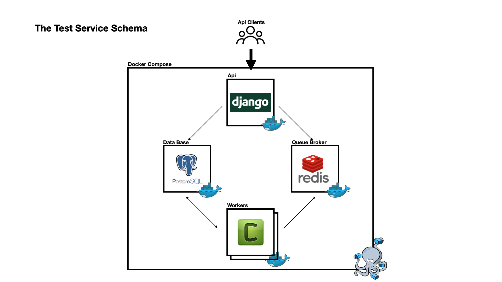

# AlmaService Hiring Test | Backend Developer

# The Task Description
Задача
Необходимо создать сервис для вызова некоторого расчета (kernel.py) и хранения результатов. Результаты расчетов должны храниться в базе данных. Сервис должен предоставлять API, работающее поверх HTTP в формате JSON. 

В расчет передаются параметры date_start (формат "ГГГГ-ММ-ДД"), date_fin (формат "ГГГГ-ММ-ДД"), lag (целое число).

Результатом расчета является DataFrame с полями 'date' (формат "ГГГГ-ММ-ДД"), 'liquid' (вещественное число), 'oil' (вещественное число), 'water' (вещественное число), 'wct' (вещественное число).

Требования
•	Язык программирования python — очень желательно, так как это основной язык для нас;
•	Предусмотреть очередь запусков, чтобы можно было запустить несколько расчетов друг за другом;
•	Финальную версию сделать с возможностью запустить через Docker и передать через архив с инструкцией по установке;
•	Простая инструкция для запуска;
•	3 метода: получение списка последних 10 запусков расчетов, получение одного расчета, создание расчета;
•	Валидация полей в передаваемых параметрах

Если есть сомнения по деталям — решение принять самостоятельно, но в своём README.md рекомендуем выписать вопросы и принятые решения по ним. Разрешается менять модуль расчета kernel.py, без изменения структуры выходного результата (5 столбцов в таблице).

Детали

Метод получения списка последних 10 запусков расчетов
•	Пагинация: на одной странице должно присутствовать 10 расчетов;
•	Сортировки: по дате запуска (возрастание/убывание);
•	Поля в ответе: название расчета, дата запуска, статус (завершен, идет расчет, в очереди).

Метод получения конкретного расчета
•	Обязательные поля в ответе: все поля возвращаемого датафрейма, дата запуска, статус. Если расчёт еще не окончен, то ответ = None. Результат должен быть сериализован в JSON, для дальнейшей возможности передачи на фронт.
•	Опциональные поля (можно запросить, передав параметр fields): название расчета, время затраченное на расчет.

Метод создания расчета:
•	Принимает все вышеперечисленные поля: date_start, date_fin, lag;
•	Возвращает ID созданного расчета.

Усложнения

Не обязательно, но задание может быть выполнено с любым числом усложнений:
•	Юнит тесты: постарайтесь достичь покрытия в 70% и больше;
•	Архитектура сервиса описана в виде текста и/или диаграмм
•	Документация: есть структурированное описание методов сервиса.

# The Answer
## Comment

> Поля в ответе: название расчета, дата запуска, статус (завершен, идет расчет, в очереди).
- вместо даты расчета возвращаю дату и время соответственно
> Принимает все вышеперечисленные поля: date_start, date_fin, lag;
- не понятно, почему "не принимает" название расчета, если, как описано выше, вы его готовы и хотели бы возвращать, кто тогда создаст это название. PS. добавил поле с названием для создания
- почему не создал 1 api под получение деталей расчета и создание расчета, как это принято в RFW: get - получение, post - создание, i.e. в 1 api? - потому что согласно тех. описанию поведение апишек и их след (body) отличаются. В таком случае лучше не городить в 1 view кучу кода, а явно делить на разные методы

## Description

В описании ниже полагается, что постановка задачи ясна. Для ее решения в db (Data Base) я храню `Computaion` & `Result`. Вторая модель имеет `ForeignKey` на первую.
Расчет отдается в очередь автоматически при сохранения `Computation`.

В качестве api используется RestFrameWork. Соответственно, все ответы django-сервера выполняются по этому типу протокола. Документация присутсвует, ниже.

В задаче, как мне видится, основной упор на том, что нам нужно запускать ресурсоемкие задачи, особенно по времени, потому однозначно было принято вынести такие вычисления в отдельные процессы, а не Django-треды (что \[Django-threads\], кст, явлется `bad practise`). 
Для организации таких вычислений я выбрал стандартный стек: Celery в качестве воркера и Redis в качестве брокера над очередью задач.

По итогу, каждый сервис представляет собой Docker Container, а оркестратором над этими контейнерами я выбрал Docker Compose, в виду простоты использования и удобной локальной разработки кода, с привязыванием локальных дирректорий к volume'ам контейнеров.

## Schema



## Api Endpoints Documentation
Сервис, запущенный с помощью `dockerc-compose up` из данного репозитория доступен извне на `8000` порту хоста. Например, по `https://localhost:8000`.

У Сервиса есть техническая документация, она доступна по ссылке `http://localhost:8000/api/swagger-ui/`.

Что можно отметить отдельно от документации:
- `Метод создания расчета`: как упоминалось выше, поскольку использованы стандартные схемы ответа RFW, то в случае неправильных параметров для создания расчета, вернется json с полями и их ошибками.
- `Метод получения конкретного расчета`: реализовано использование GET параметра под доп. поля
- `Метод получения списка последних 10 запусков расчетов`: -

### How To Start The Stack
```
docker-compose up
```
> на хосте должен быть установлен `Docker` & `Docker Compose` соответственно

### Tests
У сервиса есть несколько основных тестов. для запуска В отдельном терминале достаточно написать следующее (OS Unix)
```
docker exec -ti $(docker ps --filter expose=8000 -q) sh -c "./manage.py test"
```
или любым другим способом
